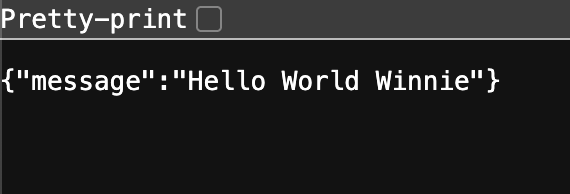

# FastAPI with PostgreSQL and Docker - Complete Setup Guide

This tutorial will guide you through setting up a complete FastAPI application with PostgreSQL database using Docker containers. By the end of this tutorial, you'll have a fully functional API with database connectivity, all running in isolated containers.


## Project Overview

We'll create a FastAPI application that:
- Runs in a Docker container
- Connects to a PostgreSQL database (also in Docker)

The final project structure will look like this:

```
setup-demo/
├── app/
│   ├── __init__.py
│   ├── main.py
│   ├── config.py
│   └── database.py
├── docker-compose.yml
├── Dockerfile
├── requirements.txt
├── .env
└── .dockerignore
```

## Prerequisites

Before starting, make sure you have:

- **Docker** installed on your system (You can download docker from https://www.docker.com/products/docker-desktop)
- A code editor (VS Code, PyCharm, etc.)
- Basic knowledge of Python and REST APIs

You can verify your Docker installation by running:

```bash
docker --version
docker-compose --version
```

## Step 1: Project Structure

Create a new directory for your project and set up the basic structure:

```bash
mkdir setup-demo
cd setup-demo
```

Create a .env file in the root directory. This is where we'll store all our app secrets.
```bash
touch .env
```

Create a sub-directory for all your core app logic 
```bash
mkdir app
cd app
touch __init__.py
```

At this point, your file structure should look like this:

```
setup-demo/
├── app/
│   ├── __init__.py
├── .env
```

## Step 2: Docker Container for FastAPI App 
In the root directory, create a `docker-compose.yml`, which is used to define your services, which is just web for now:

```yaml
# docker-compose.yml
services:
  web:
    build: .
    container_name: setup-demo-web
    ports:
      - "8000:8000"
    env_file: .env
    volumes:
      - ./app:/app
```

`build .` means docker will look in the root `.` directory for a Dockerfile (we'll create that next)
`.env` is where our environment varialbes will live 
`
 volumes:
      - ./app:/app
`
The volumes entry is setting up a bind-mount between your host machine and the running container. 
- `./app` (left of the colon) is the path on your host (relative to where your docker-compose.yml lives). 
- `/app` (right of the colon) is the path inside the container.

Anything you change in your local ./app folder instantly appears in /app inside the container.
Likewise, if the container writes files into /app, you’ll see them locally.
This is super handy in development—paired with Uvicorn’s --reload, you can edit code locally and see the server pick up changes immediately without rebuilding the image.

Next create a `Dockerfile` to tell docker how to run our FastAPI app 

```bash
# syntax=docker/dockerfile:1

FROM python:3.11-slim

# Set working directory
WORKDIR /app

# Install dependencies
COPY requirements.txt .
RUN pip install --no-cache-dir -r requirements.txt

# Expose port (optional if using behind reverse proxy)
EXPOSE 8000

# Start FastAPI app
CMD ["uvicorn", "main:app", "--host", "0.0.0.0", "--port", "8000", "--reload"]
```

Finally, create a `requirements.txt` to specify the python packages we'll need in our web app. It'll start off with something like this.

```python
fastapi
uvicorn
```

Now the project structure should look something like this, we're almost there. 

```
setup-demo/
├── app/
│   ├── __init__.py
├── docker-compose.yml
├── Dockerfile
├── requirements.txt
├── .env
```

## Step 3: Adding a main.py 
Now all we need to do is add the boilerplate main.py file into our app folder to run the FastAPI app. 

```python
from fastapi import FastAPI

app = FastAPI()


@app.get("/")
async def root():
    return {"message": "Hello World"}
```

You will also need to install the python packages locally, in an virtual environment. The general workflow will look like this: 

```bash
python3 -m venv .venv
source .venv/bin/activate
pip install --upgrade pip
pip install -r requirements.txt
```

## Step 4: Running the webapp 

`docker compose up` should do the trick. 
You should be able to navigate to the web host and see



To bring down the web instance you can press control + C in your terminal or `docker compose down`

Some other helpful docker commands to note:
`docker ps` will show you which containers are running
`docker stop <container-name>` to stop the container 

## Step 5: Adding a db container in Docker

So we want to also connect to a postgres database. We need to add a few configurations. 

In the `docker-compose.yml`, we need to define a service for our db. Luckily, there's a default postgres image `postgres:15` we can use off the shelf. This way, there's no need to write another Dockerfile. We need to give it some configs as we did for `web` including the env_file location, the ports mapping, and the volume. 

```yml 
volumes:
    - postgres-data:/var/lib/postgresql/data
```
This tells Docker, “give this container a volume called postgres-data and mount it at /var/lib/postgresql/data.”
- postgres-data (left of the colon) is a named volume (not a path on your host).
- /var/lib/postgresql/data is where Postgres stores its database files inside the container.
We then define the postgres-data volume, leaving the right side of the colon empty means “create a plain Docker-managed volume.”

```yml
services:
  web:
    build: .
    container_name: setup-demo-web
    ports:
      - "8000:8000"
    env_file: .env
    volumes:
      - ./app:/app
    depends_on:
      - db
  db:
    image: postgres:15
    restart: unless-stopped
    container_name: setup-demo-postgres
    env_file: .env
    ports:
      - "5432:5432"
    volumes:
      - postgres-data:/var/lib/postgresql/data
volumes:
  postgres-data:
```

The postgres image needs a few more configs, namely the db username and password, which it'll look for in the .env file! 

```python
DB_USERNAME=winnie-user
DB_PASSWORD=winnie-password
DB_NAME=demo-db
```

## Step 6: Take a look around your database 

Now if you run `docker compose up` again, you'll spin up with a web service and a default postgres db service. 

You can take a look around your postgres db through docker like this:

`docker exec -it <db-container-name> psql -U winnie-user -d <db-name-in-env-file>`

`docker exec -it setup-demo-postgres psql -U winnie-user -d demo-db`

and then you can use `\dt` to list all tables. But likely right now you have none. 


## Step 7: Connecting the database with the web app 

We'll first create a config.py file in our app directory to read the environment variables. 

```python
from functools import lru_cache
from pydantic_settings import BaseSettings, SettingsConfigDict

class Settings(BaseSettings):
    db_username: str 
    db_password: str
    db_name: str

    model_config = SettingsConfigDict(env_file=".env")

@lru_cache
def get_settings():
    return Settings()
```

The Settings class defines the schema that can be expected from the .env file. Notice that FastAPI is able to convert between captialized variable names in the .env file to lower case here (DB_USERNAME v db_username)
Because these variables are not expected to change, we can add caching to make the fetch more performant. 

Next, let's define the database connection. Create a database.py file

```python
from sqlmodel import SQLModel, Session, create_engine
from config import get_settings

settings = get_settings()

# create_engine using the env var
database_url =f"postgresql://{settings.db_username}:{settings.db_password}@db:5432/{settings.db_name}"
engine = create_engine(database_url, echo=False)

def create_db_and_tables() -> None:
    SQLModel.metadata.create_all(engine)

def get_session():
    with Session(engine) as session:
        yield session
```
Here we read from our settings config, build the db URL and define 2 function which we'll call from main.py to help hook up our database. 

create_engine(...) takes that URL and builds an Engine object, which encapsulates:
- A connection pool (so you don’t pay the overhead of opening/closing a TCP connection on every query).
- The correct dialect (SQL syntax variations) for your chosen database.

Within main.py, we want to first ensure that we're creating the db engine on startup.  
```python
@asynccontextmanager
async def lifespan(app: FastAPI):
    create_db_and_tables()
    yield

app = FastAPI(lifespan=lifespan)
```
We also need to add in a session dependency. Any function that will need to interact with the database and have this dependency injected 
```python
SessionDep = Annotated[Session, Depends(get_session)]
```
Finally we can define our schema
```python
class Hero(SQLModel, table=True):
    id: int | None = Field(default=None, primary_key=True)
    name: str = Field(index=True)
    age: int | None = Field(default=None, index=True)
    secret_name: str
```

and add a post endpoint for creating a default hero!
```python
@app.post("/heroes/")
def create_hero(name: str, session: SessionDep) -> Hero:
    hero = Hero(name=name, secret_name=f"secrete_{name}")
    session.add(hero)
    session.commit()
    session.refresh(hero)
    return hero
```

### Next Steps:

You can extend this setup by:
- Adding authentication and authorization
- Implementing more complex data models
- Adding background tasks
- Setting up testing with pytest
- Adding logging and monitoring
- Implementing caching with Redis
- Setting up CI/CD pipelines

The foundation is now solid for building more complex applications with FastAPI and PostgreSQL! 